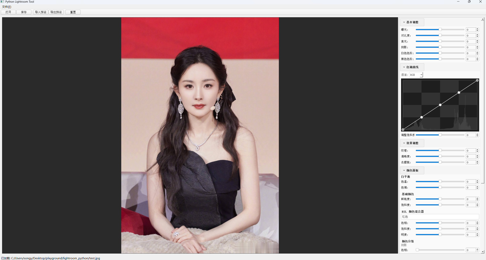
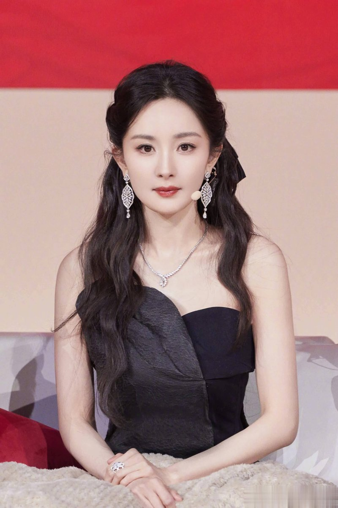
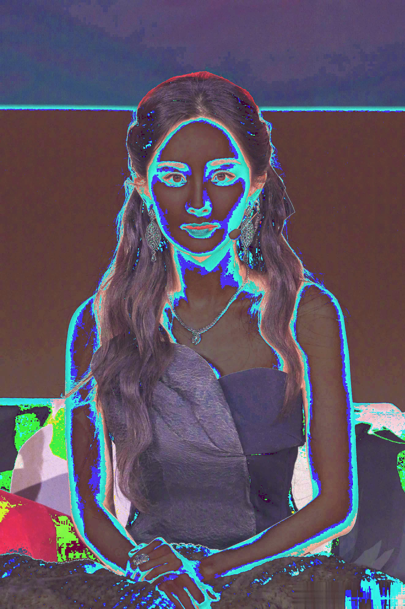

# Python Lightroom Tool

一个基于 Python 的 Lightroom 风格图像编辑工具，支持非破坏性编辑。



## 功能特性

- 非破坏性编辑：永远不修改原始文件，通过参数栈实时计算效果
- 支持 JPG、PNG、BMP、TIFF 等常见图像格式
- 实时预览编辑效果
- 预设导入/导出功能
- 命令行批量处理支持

## 已实现功能模块

### 基本调整面板 (Basic Panel) ✅
| 功能 | 参数范围 | 说明 |
|------|----------|------|
| 曝光 | -100 ~ +100 | 调整整体亮度，影响中间调 |
| 对比度 | -100 ~ +100 | 调整画面明暗反差 |
| 高光 | -100 ~ +100 | 调整画面中最亮的部分 |
| 阴影 | -100 ~ +100 | 调整画面中最暗的部分 |
| 白色色阶 | -100 ~ +100 | 调整图像最亮端的极限值 |
| 黑色色阶 | -100 ~ +100 | 调整图像最暗端的极限值 |

### 色调曲线面板 (Tone Curve Panel) ✅
| 功能 | 说明 |
|------|------|
| RGB 复合曲线 | 对整体亮度进行调整 |
| 分通道曲线 | 独立调整红、绿、蓝三个通道 |
| 曲线饱和度 | 调整曲线应用时的颜色饱和度 |
| 直方图显示 | 在曲线编辑器背景显示图像直方图 |

曲线编辑器支持：
- 拖动控制点调整曲线形状
- 双击空白处添加新控制点
- 双击控制点删除（端点除外）
- 三次样条插值实现平滑曲线

### 效果调整面板 (Effects Panel) ✅
| 功能 | 参数范围 | 说明 |
|------|----------|------|
| 纹理 | -100 ~ +100 | 增强/平滑中等尺度细节 |
| 清晰度 | -100 ~ +100 | 通过局部对比度增强深度和质感 |
| 去朦胧 | -100 ~ +100 | 移除或添加画面中的雾霾感 |

### 颜色面板 (Color Panel) ✅

#### 白平衡
| 功能 | 参数范围 | 说明 |
|------|----------|------|
| 色温 | -100 ~ +100 | 调整画面冷暖色调（负值偏蓝，正值偏黄） |
| 色调 | -150 ~ +150 | 调整画面绿/洋红偏色 |

#### HSL 颜色混合器
对 8 种颜色（红、橙、黄、绿、青、蓝、紫、洋红）分别调整：
| 功能 | 参数范围 | 说明 |
|------|----------|------|
| 色相 | -100 ~ +100 | 改变所选颜色的色彩 |
| 饱和度 | -100 ~ +100 | 改变所选颜色的鲜艳程度 |
| 明度 | -100 ~ +100 | 改变所选颜色的亮度 |

#### 颜色分级
| 功能 | 参数范围 | 说明 |
|------|----------|------|
| 阴影色相 | 0 ~ 360° | 为阴影区域添加色彩 |
| 阴影饱和度 | 0 ~ 100 | 阴影颜色浓淡 |
| 高光色相 | 0 ~ 360° | 为高光区域添加色彩 |
| 高光饱和度 | 0 ~ 100 | 高光颜色浓淡 |
| 混合 | 0 ~ 100 | 控制色调区域过渡平滑度 |
| 平衡 | -100 ~ +100 | 控制效果在阴影和高光之间的偏向 |

#### 基础颜色调整
| 功能 | 参数范围 | 说明 |
|------|----------|------|
| 鲜艳度 | -100 ~ +100 | 智能调整低饱和度颜色 |
| 饱和度 | -100 ~ +100 | 统一调整所有颜色饱和度 |

### 细节面板 (Detail Panel) ✅

#### 锐化
| 功能 | 参数范围 | 说明 |
|------|----------|------|
| 数量 | 0 ~ 150 | 控制锐化强度 |
| 半径 | 0.5 ~ 3.0 | 控制锐化边缘周围的像素范围 |
| 细节 | 0 ~ 100 | 控制锐化在纹理上的强调程度 |
| 遮罩 | 0 ~ 100 | 控制锐化效果的蒙版范围 |

#### 降噪
| 功能 | 参数范围 | 说明 |
|------|----------|------|
| 明度 | 0 ~ 100 | 减少黑白颗粒状的明度噪点 |
| 颜色 | 0 ~ 100 | 减少彩色斑点的颜色噪点 |

### 预设功能 ✅
| 功能 | 说明 |
|------|------|
| 导入预设 | 从 JSON 文件加载编辑参数 |
| 导出预设 | 将当前编辑参数保存为 JSON 文件 |

### 其他已实现功能 ✅
- 图像加载与显示（支持缩放预览）
- 编辑后图像保存（全分辨率输出）
- 参数重置功能
- 快捷键支持
- 可折叠编辑面板（点击面板标题折叠/展开）
- 浅色主题界面

## 环境要求

- Python 3.10+
- Conda（推荐）

## 安装步骤

### 1. 创建 Conda 环境

```bash
# 创建并激活环境
conda env create -f environment.yml
conda activate lightroom
```

或者手动创建：

```bash
conda create -n lightroom python=3.10
conda activate lightroom
conda install -c conda-forge pyqt pillow numpy scipy
```

### 2. 运行程序

```bash
cd lightroom_python
python main.py
```

或者在 Windows 上双击 `run.bat`

### 3. 命令行使用（CLI）

支持通过命令行批量处理图像：

```bash
# 基本用法
python cli.py -i input.jpg -p params.json -o output.jpg

# 完整参数名
python cli.py --input input.jpg --param params.json --output output.jpg

# 查看帮助
python cli.py --help
```

## 参数 JSON 文件格式

```json
{
  "exposure": 10,
  "contrast": 15,
  "highlights": -25,
  "shadows": 30,
  "whites": 10,
  "blacks": -15,
  "texture": 25,
  "clarity": 20,
  "dehaze": 15,
  "vibrance": 20,
  "saturation": 10,
  "temp": 8,
  "tint": 5,
  "hsl_hue_red": 3,
  "hsl_sat_red": 10,
  "hsl_lum_red": -5,
  "cg_shadows_hue": 230,
  "cg_shadows_sat": 25,
  "cg_highlights_hue": 45,
  "cg_highlights_sat": 20,
  "cg_blending": 50,
  "cg_balance": 10,
  "sharpen_amount": 60,
  "sharpen_radius": 1.0,
  "sharpen_detail": 30,
  "sharpen_masking": 20,
  "noise_luminance": 15,
  "noise_color": 10,
  "curve_rgb": [[0, 0], [64, 70], [128, 128], [192, 180], [255, 255]],
  "curve_red": [[0, 0], [64, 64], [128, 130], [192, 192], [255, 255]],
  "curve_green": [[0, 0], [64, 64], [128, 128], [192, 192], [255, 255]],
  "curve_blue": [[0, 0], [64, 66], [128, 126], [192, 192], [255, 255]],
  "curve_saturation": 10
}
```

### 曲线参数说明

曲线参数格式为控制点数组 `[[x1, y1], [x2, y2], ...]`，每个点的 x, y 范围为 0-255：
- `curve_rgb`: RGB 复合曲线
- `curve_red`: 红色通道曲线
- `curve_green`: 绿色通道曲线
- `curve_blue`: 蓝色通道曲线
- `curve_saturation`: 曲线饱和度调整 (-100 到 100)

## 使用说明

### 打开图像
- 点击菜单 `文件 -> 打开` 或工具栏 `打开` 按钮
- 支持格式：JPG, JPEG, PNG, BMP, TIF, TIFF

### 编辑图像
- 在右侧编辑面板调整各项参数
- 参数调整会实时反映在图像预览中
- 所有编辑均为非破坏性，可随时重置

### 色调曲线使用
1. 选择要编辑的通道（RGB/红/绿/蓝）
2. 拖动曲线上的控制点调整曲线形状
3. 双击曲线空白处添加新控制点
4. 双击控制点删除（端点不可删除）
5. 使用"调整饱和度"滑块控制曲线效果的色彩饱和度

### 保存图像
- 点击菜单 `文件 -> 保存` 或工具栏 `保存` 按钮
- 选择保存路径和格式

### 使用预设
- **导入预设**：`文件 -> 导入预设` 或工具栏 `导入预设` 按钮
- **导出预设**：`文件 -> 导出预设` 或工具栏 `导出预设` 按钮
- 预设文件格式为 JSON，可分享给他人使用

### 重置编辑
- 点击工具栏 `重置` 按钮或编辑面板 `重置所有调整` 按钮
- 所有参数恢复为默认值

## 快捷键

| 快捷键 | 功能 |
|--------|------|
| Ctrl+O | 打开图像 |
| Ctrl+S | 保存图像 |
| Ctrl+I | 导入预设 |
| Ctrl+E | 导出预设 |
| Ctrl+Q | 退出程序 |

## 效果展示

### 原图 vs 编辑后

| 原图 | 编辑后 |
|:----:|:------:|
|  |  |

### 编辑参数（full_preset.json）

上面的效果使用了以下参数：
- 曝光 +10, 对比度 +15
- 高光 -25, 阴影 +30
- 纹理 +25, 清晰度 +20
- S型曲线增强对比度
- 颜色分级：阴影偏蓝，高光偏暖

## 项目结构

```
lightroom_python/
├── main.py              # 应用入口（GUI）
├── cli.py               # 命令行接口
├── sample_params.json   # 示例参数文件
├── full_preset.json     # 全量参数预设文件
├── environment.yml      # Conda 环境配置
├── requirements.txt     # pip 依赖
├── run.bat              # Windows 启动脚本
├── setup_env.bat        # 环境安装脚本（Windows）
├── setup_env.sh         # 环境安装脚本（Linux/Mac）
├── ui/
│   ├── __init__.py
│   ├── main_window.py   # 主窗口 UI
│   └── curve_widget.py  # 色调曲线控件
├── core/
│   ├── __init__.py
│   └── editor.py        # 图像编辑核心功能
├── utils/
│   ├── __init__.py
│   └── file_utils.py    # 文件操作工具
└── tests/
    ├── __init__.py
    └── test_features.py # 功能测试脚本
```

## 技术栈

- **GUI 框架**: PyQt5
- **图像处理**: Pillow (PIL), NumPy
- **曲线插值**: SciPy (Cubic Spline)

## 开发计划

- [x] 基本调整面板
- [x] 效果调整面板
- [x] 颜色面板（白平衡、HSL、颜色分级）
- [x] 细节面板（锐化、降噪）
- [x] 色调曲线面板
- [ ] 裁剪工具
- [ ] 局部调整（画笔/渐变滤镜）
- [ ] 批量处理
- [ ] RAW 格式支持
